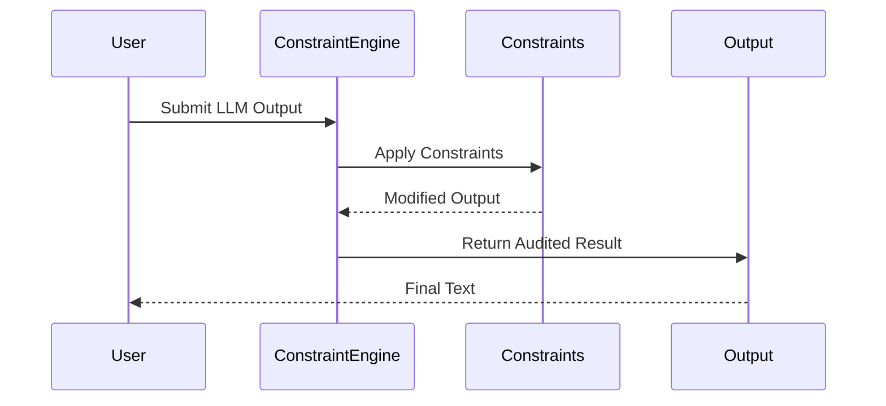

# Constraint Lattice

[](https://github.com/ochoaughini/Constraint-Lattice/actions/workflows/docker-publish.yml)
[](https://opensource.org/licenses/MPL-2.0)
[](./coverage)

**Unlock the Power of Composable Constraints**

Deterministic, auditable post-processing governance framework for Large Language Model (LLM) outputs.

Constraint Lattice enables **composable constraints** that rewrite, redact, or regenerate model outputs until they satisfy your policy requirements. All executions are fully auditable and reproducible without model retraining.

## Table of Contents
- [Key Features](#key-features)
- [Architecture](#architecture)
- [Installation](#installation)
- [Quick Start](#quick-start)
- [Project Structure](#project-structure)
- [Documentation](#documentation)
- [Contributing](#contributing)
- [License](#license)

## Key Features

- **Declarative Pipelines**: YAML-driven configuration for pure-Python `Constraint` classes
- **Multi-Platform Support**: CLI (`cl-apply`), Python SDK, FastAPI microservice, Streamlit audit viewer
- **Deterministic Execution**: JSONL audit logs for governance and compliance
- **GPU Acceleration**: Optional vLLM/JAX backend for high-performance moderation
- **Production Ready**: Prometheus metrics and Stripe billing integration
- **Cognitive Components**: optional package `cognitive_arch` providing hierarchical memory, metacognitive logging, agent governance and adaptive ethics utilities

## Architecture

Constraint Lattice operates through a multi-stage constraint application pipeline:



### Core Components

1. **Constraint Engine**: Orchestrates constraint application and audit logging
2. **Constraint Library**: Pre-built constraints for common moderation tasks
3. **Audit System**: Generates JSONL logs for every constraint application
4. **API Gateway**: REST interface for integration with LLM services

## Installation

### Local Development

```bash
git clone https://github.com/ochoaughini/Constraint-Lattice.git
cd Constraint-Lattice

# Install runtime toolchains, Python dependencies, Node packages, and pre-commit hooks
make bootstrap

# Launch the full developer experience (API, frontend, background services)
make dev
```

The bootstrap process uses `.tool-versions` to pin Python 3.11 and Node.js 18. If you prefer manual
installation, consult `CONTRIBUTING.md` for the exact steps to replicate the automated process.

### Docker

```bash
docker compose up --build
```

### Cloud Deployment
See our [deployment guide](docs/hybrid_deployment_strategy.md) for GCP/AWS configurations.

## Quick Start

```python
from constraint_lattice import apply_constraints

result = apply_constraints(
    text="Your LLM output here",
    policy_path="path/to/policy.yaml"
)
print(result.filtered_text)
```

### Launch the Dashboard

```bash
yarn dev:dashboard
```

## Project Structure

```
Constraint-Lattice/
├── src/                         # Python packages, services, and adapters
├── tests/
│   ├── unit/                    # Fast-running, deterministic unit tests
│   ├── integration/             # Service and module integration suites
│   └── e2e/                     # Behavioral end-to-end scenarios
├── docs/
│   ├── adr/                     # Architectural decision records
│   └── ...                      # Product and API documentation
├── scripts/
│   ├── bootstrap                # Toolchain installation
│   ├── check                    # Aggregate local CI command
│   └── legacy/                  # Historical utilities maintained for reference
├── configs/                     # Configuration manifests (policies, YAML, JSON)
├── infra/                       # Docker, Kubernetes, and platform infrastructure
├── ci/                          # Reusable CI templates and pipelines
├── assets/                      # Static assets and marketing collateral
├── data/                        # Sample datasets and fixtures (non-production)
└── project.yaml                 # Repository metadata contract
```

## Developer Tasks

| Command | Description |
| --- | --- |
| `make bootstrap` | Install Python/Node toolchains, dependencies, and pre-commit hooks. |
| `make dev` | Launch the API, frontend, and backing services with hot reload. |
| `make lint` | Run Ruff, Black, isort, ESLint, and Prettier checks. |
| `make fmt` | Apply formatters (Black, isort, Ruff format, Prettier). |
| `make typecheck` | Execute mypy in strict mode and `tsc --noEmit`. |
| `make test` | Run unit and integration tests with coverage reporting. |
| `make e2e` | Execute end-to-end scenarios against the docker-compose stack. |
| `make coverage` | Enforce coverage thresholds and generate reports. |
| `make build` | Produce distributable artifacts (Python wheel, frontend bundle, container image). |
| `make package` | Package release artifacts for distribution registries. |
| `make release` | Run semantic-release, update the changelog, and create signed tags. |
| `make update-deps` | Apply batched dependency updates with Renovate-style grouping. |
| `make security-scan` | Run dependency, secret, and container vulnerability scans. |
| `make sbom` | Generate SPDX SBOMs for the repository and container images. |
| `make gen-docs` | Rebuild API and developer documentation. |
| `make migrate` | Apply database schema migrations deterministically. |
| `make clean` | Remove build artifacts, caches, and temporary files. |
| `make check` | Aggregate lint, typecheck, test, coverage, and security gates. |

## Documentation

- [Core Concepts](docs/principles.md)
- [API Reference](docs/api.md)
- [Tutorial](docs/tutorial.md)
- [Advanced Schemas](docs/advanced_schemas_and_operations.md)
- [Deployment Strategies](docs/hybrid_deployment_strategy.md)

## Contributing
We welcome contributions! Please see our [Contribution Guidelines](CONTRIBUTING.md).

## License

Constraint Lattice is released under the [Mozilla Public License 2.0](LICENSE). This file-based copyleft license encourages collaboration while ensuring improvements remain accessible to the community.

### Third-Party Licenses
- [VarkielAgent](https://github.com/ochoaughini/VarkielAgent) uses a proprietary license
- [WildCore](https://github.com/ochoaughini/WildCore) uses the Mozilla Public License 2.0
